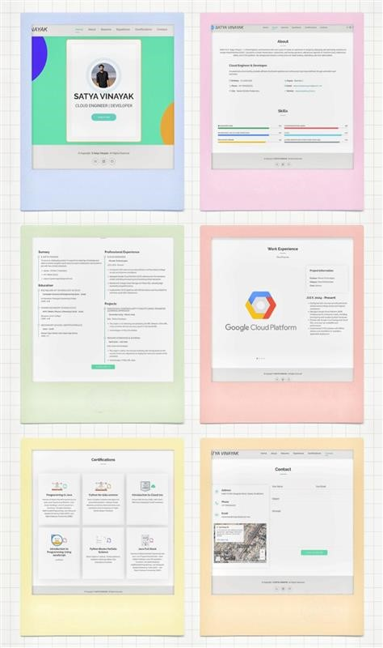

# 💼 satyavinayak-E.github.io

This is my personal portfolio website, built using HTML, CSS, and JavaScript<!-- based on the template by ([Booststrapmade](https://bootstrapmade.com/)) idea.-->

It showcases my projects, skills, resume, and contact information in a responsive, clean, and professional design.

---

## 🌐 Live Demo

[Click here to view ](https://satyavinayak-e.github.io/)

---

## 🚀 Features

- Responsive design for mobile, tablet, and desktop
- Smooth scrolling and animated sections
- Downloadable resume
- Project portfolio section
- Contact form and embedded map
- Social media and email links

---

## 📁 Project Structure 
```bash
Satya_vinayak/
|   about.html
|   certificates.html
|   contact.html
|   ESVResume.pdf
|   experience.html
|   index.html                             # Main homepage to open the template in the browser
|   License.txt                            # License information 
|   Portfolio_Thumbnail.jpg                # Snippet of the website
|   README.md
|   Readme.txt                             # Project documentation
|   resume.html
|   
\---assets
    +---css                                # CSS framework
    +---img                                # images required for the template
    |   +---certificates
    |   \---exp
    +---js                                 # JS file
    \---vendor                             # Animate On Scroll for scroll and slide based animations
        +---aos
        +---bootstrap
        |   +---css
        |   \---js
        +---bootstrap-icons
        |   \---fonts
        +---glightbox
        |   +---css
        |   \---js
        +---imagesloaded
        +---isotope-layout
        +---php-email-form
        +---purecounter
        +---swiper
        \---waypoints                
```
---
## 📸 A Glimpse Into My Potfolio Website 



### 📫 Contact 
Feel free to reach out via the contact form on the site or email me at:  
[](https://www.linkedin.com/in/satya-vinayak-e-65636033b)
[](https://github.com/Satyavinayak-E)
[](mailto:satyavinayakerragunta@gmail.com)
